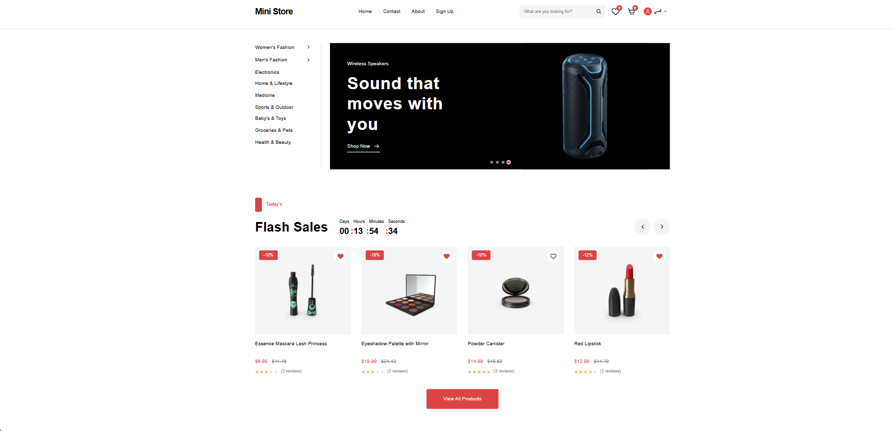
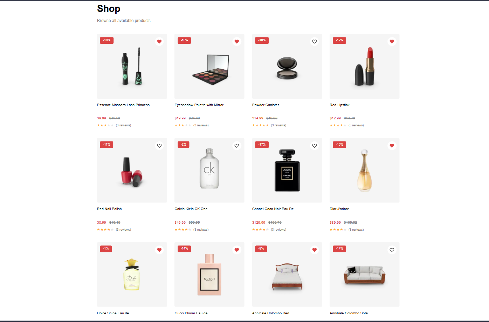
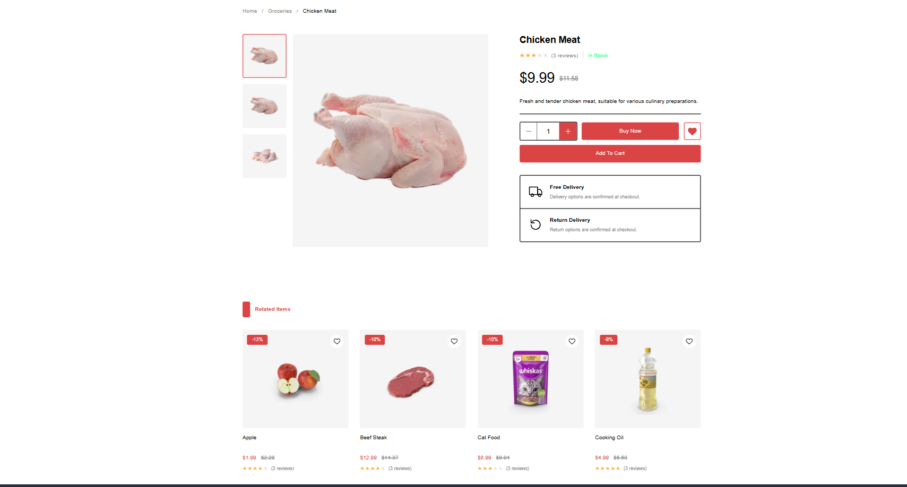
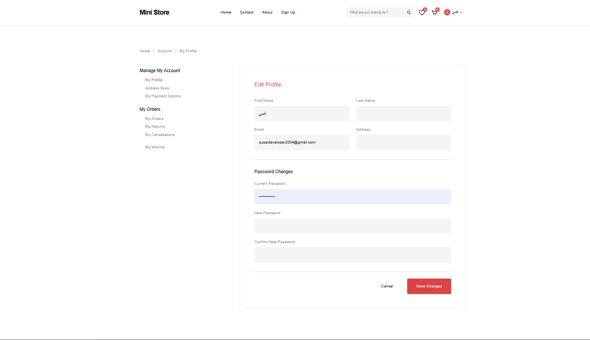

# 🛒 Exclusive - E-Commerce Web Application (Mini Store)

A modern, high-performance, full-featured E-Commerce web application built with **Next.js 16 (App Router)**, **React 19**, **TypeScript**, and **Tailwind CSS v4**.

Includes full internationalization (i18n) support for **Arabic (RTL)** and **English (LTR)**.

---

## 🔗 Live Demo

👉 **[🌐 Open Live Demo App](https://mini-store-gilt.vercel.app/)**

---

## 🖼️ Screenshots

### Home Page



### Shop Page



### Product Details



### Account Page




---

## 🌟 Key Features

### 🌐 Internationalization (i18n) & RTL Support

- **Multi-language Support:** Seamless switching between **Arabic (`ar`)** and **English (`en`)**.
- **Native RTL/LTR Layouts:** Automatic layout direction adjustment based on the active locale.

### 🛍️ Shopping & Catalog

- **Home Page Sections:**
  - Dynamic Hero Slider / Banners
  - Flash Sales with countdown timer
  - Category Explorer & Best Selling products
  - Special Featured Banner (Promotions)
  - Explore All Products Grid
  - New Arrival Section & Customer Service Highlights
- **Product Details Page:** Multi-image selection, color/size options, rating & reviews, quantity selectors, and related products.
- **Category & Shop Filter:** Filter products by categories, price ranges, and tags.

### 🛒 Shopping Cart & Wishlist

- **Cart Management:** Add, remove, update quantities, coupon code support, subtotal, shipping, and total calculation.
- **Wishlist:** Save favorite items, quick move items from wishlist to cart.

### 💳 Checkout & User Account

- **Checkout Process:** Billing information form with **Zod** validation, order summary, cash on delivery / online payment selection.
- **User Profile & Account Dashboard:**
  - Account Profile Management
  - Address Book Management
  - Payment Options Management
  - Order History & Tracking
  - Returns & Cancellations Center

### 🔐 Authentication

- **User Authentication:** Login, Registration (Sign Up), and Password Reset (Forgot Password) pages powered by **React Hook Form** & **Zod**.

---

## 🛠️ Tech Stack

- **Framework:** [Next.js 16 (App Router)](https://nextjs.org/)
- **UI Library:** [React 19](https://react.dev/)
- **Language:** [TypeScript](https://www.typescriptlang.org/)
- **Styling:** [Tailwind CSS v4](https://tailwindcss.com/)
- **State Management:** [Zustand 5](https://github.com/pmndrs/zustand)
- **Internationalization:** [next-intl 4](https://next-intl.dev/)
- **Form Handling:** [React Hook Form](https://react-hook-form.com/)
- **Schema Validation:** [Zod](https://zod.dev/)
- **Icons:** SVG & Custom Icon components

---

## 📁 Project Structure

```text
mini-store/
├── public/                # Static assets & images
├── src/
│   ├── app/
│   │   └── [locale]/      # Localized App Router routes (ar / en)
│   │       ├── account/   # User Profile, Orders, Addresses, Cancellations
│   │       ├── cart/      # Shopping Cart page
│   │       ├── checkout/  # Checkout page
│   │       ├── product/   # Product details
│   │       ├── shop/      # Shop / Products listing
│   │       ├── wishlist/  # Saved items page
│   │       ├── login/     # Login page
│   │       └── signup/    # Signup page
│   ├── components/        # Reusable UI components organized by module
│   │   ├── home/          # Home sections (FlashSales, BestSelling, etc.)
│   │   ├── layout/        # Navbar, Footer, Header, Language Switcher
│   │   ├── product/       # Product Card, Product Gallery, Details
│   │   └── ui/            # Basic UI primitives (Button, Input, Modal)
│   ├── data/              # Mock products, categories & sample data
│   ├── i18n/              # next-intl configuration & routing setup
│   ├── messages/          # Localization JSON files (ar.json, en.json)
│   ├── schemas/           # Zod validation schemas
│   ├── store/             # Zustand state management stores
│   └── types/             # TypeScript interfaces & types
├── package.json           # Dependencies & build scripts
└── README.md              # Project documentation
```

---

## 🚀 Getting Started

### Prerequisites

Ensure you have **Node.js 20.x or later** and `npm` installed.

### Installation

1. **Clone the repository:**

   ```bash
   git clone https://github.com/your-username/mini-store.git
   cd mini-store
   ```

2. **Install dependencies:**

   ```bash
   npm install
   ```

3. **Run the development server:**

   ```bash
   npm run dev
   ```

4. **Open in browser:**
   Navigate to [http://localhost:3000](http://localhost:3000) to view the app.

### Production

```bash
npm run build
npm run start
```

The production server runs at [http://localhost:3000](http://localhost:3000).

### Environment Variables

No environment variable is required for local development. You can optionally configure the canonical URL used by SEO metadata:

```env
NEXT_PUBLIC_SITE_URL=https://your-domain.com
```

---

## 📜 Available Scripts

- `npm run dev` — Starts the Next.js development server.
- `npm run build` — Builds the application for production.
- `npm run start` — Starts the production server.
- `npm run lint` — Runs ESLint to check for code quality issues.

Before deployment, run:

```bash
npm run lint
npm run build
```

---

## 🌐 Localization Guide

Translations are located in `src/messages/`:

- `src/messages/ar.json` — Arabic translations
- `src/messages/en.json` — English translations

To add a new translation key, update both `ar.json` and `en.json` files.

Localized pages use the `/en` and `/ar` prefixes, for example:

- English: `http://localhost:3000/en/shop`
- Arabic: `http://localhost:3000/ar/shop`

---

## 💾 Data and Persistence

Product data is loaded from [DummyJSON](https://dummyjson.com/). Cart, wishlist, authentication, account data, orders, returns, and cancellations are persisted in the browser using `localStorage` through Zustand persistence.

This project is currently a frontend demo. A production application would need a secure backend for authentication, database persistence, payments, and order processing.

---

## 🚀 Deployment

The application can be deployed to Vercel or another platform that supports Next.js:

1. Import the repository into the hosting provider.
2. Use `npm install` as the install command.
3. Use `npm run build` as the build command.
4. Add `NEXT_PUBLIC_SITE_URL` with the production URL.
5. Replace the Live Demo placeholder at the top of this README.

---

## 📄 License

This project is open-source and available under the [MIT License](LICENSE).
